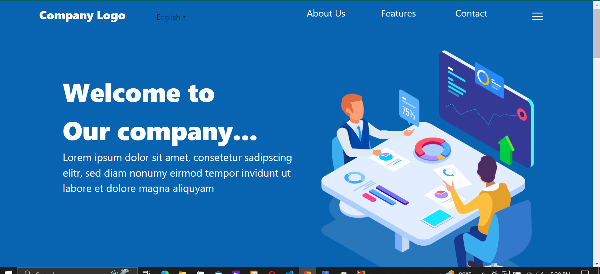

# React sample website

This is a template Web Application that uses ReactJs, Bootstrap, SCSS.

### `Live link` 

Open [https://ebeyonds.netlify.app/](https://ebeyonds.netlify.app/) to view it in the browser.

### See image below on desktop view on devices:

*My caption*

## Available Scripts

In the project directory, you can run:

### `npm start`

Runs the app in the development mode.\
Open [http://localhost:3000](http://localhost:3000) to view it in the browser.

